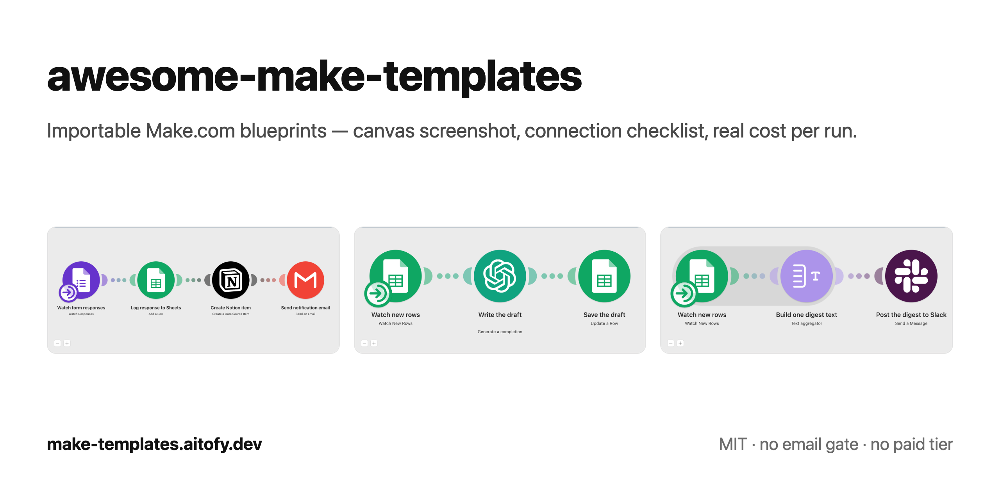

# awesome-make-templates

The open-source Make.com template library: importable scenario blueprints, not 40-step tutorials.
Each folder is one working automation — download the blueprint, import it, connect your accounts, run it.
Every template ships with a canvas screenshot, a connection checklist, and its real cost per run in operations.
No account needed to browse. No email gate. No paid tier.

Same templates as web pages: [make-templates.aitofy.dev](https://make-templates.aitofy.dev). For agents and LLMs: [llms.txt](./llms.txt), [llms-full.txt](./llms-full.txt).

**[Create a Make account](https://www.make.com/en/register?pc=aitofy&affiliateSource=github)** — referral link: Make pays us, you pay the same price.

## How do I import a Make.com blueprint?

1. **Create a Make account** using the referral link above. It is a referral link — it costs you nothing and funds this library. Already have an account? Skip to step 2.
2. **Import the blueprint.** Open a template folder, download `blueprint.json`, then in Make: *Create a new scenario → ⋯ menu → Import Blueprint*. Where a template lists a scenario link, *Use this scenario* does the same in one click.
3. **Reconnect your accounts.** Imported modules show up red. That is normal and expected — a blueprint carries no credentials. Open each red module and pick or create its connection. The template README lists exactly which connections you need.
4. **Run once.** Hit *Run once*, check the output, then turn the schedule on.

## What Make.com templates are available?

<!-- gen:templates -->
3 importable blueprints across Gmail, Google Forms, Google Sheets, Notion, OpenAI and Slack. None of them spend Make AI credits. Every row links the blueprint JSON, the one-click scenario where there is one, and a page listing the connections to reconnect after import.

| Template | Apps | Operations / run | Department | Get it |
|---|---|---|---|---|
| [Send Google Forms responses to Notion and email](./templates/google-forms-to-notion/) | Google Forms, Google Sheets, Notion, Gmail | 4 | Operations | [Use in Make](https://us2.make.com/public/shared-scenario/BYOdssUC41U/form-notion-email) · [blueprint.json](./templates/google-forms-to-notion/blueprint.json) · [page](https://make-templates.aitofy.dev/google-forms-to-notion) |
| [Turn new Google Sheets rows into AI-written drafts with OpenAI](./templates/sheets-openai-draft/) | Google Sheets, OpenAI | 3 | Marketing | [Use in Make](https://us2.make.com/public/shared-scenario/EfWP9JKmFPU/sheets-row-ai-draft) · [blueprint.json](./templates/sheets-openai-draft/blueprint.json) · [page](https://make-templates.aitofy.dev/sheets-openai-draft) |
| [Post new Google Sheets rows to Slack as one digest](./templates/sheets-to-slack-digest/) | Google Sheets, Slack | 21 | Operations | [Use in Make](https://us2.make.com/public/shared-scenario/cIr0IMnHhoH/sheets-rows-slack-digest) · [blueprint.json](./templates/sheets-to-slack-digest/blueprint.json) · [page](https://make-templates.aitofy.dev/sheets-to-slack-digest) |
<!-- /gen:templates -->

*Affiliate disclosure: links to Make.com in this repository are referral links; we may earn a commission if you sign up, at no extra cost to you.*

## How much does each scenario cost to run?

Make bills **operations**: one per module, per bundle that module handles — the trigger included. That is why a check picking up ten new rows costs more than a check picking up one, and why the same automation can cost a different amount on Monday than on Tuesday.

The *Operations / run* column above is the worked example each template documents. Its README carries the formula behind that number, the worst case at the trigger's default *Limit*, and where the count came from.

AI credits are a second, separate meter. A template that calls OpenAI with your own API key spends no Make AI credits — OpenAI bills you for the tokens instead.

## FAQ

<!-- gen:faq -->
### Does this work on the free plan?

Yes. Four standard modules, no premium apps, no AI credits. The free plan checks for new responses every 15 minutes. ([Send Google Forms responses to Notion and email](./templates/google-forms-to-notion/))

### Why are the modules red after import?

Accounts never travel inside a blueprint. Open each red module, pick or create the account, and the red disappears. ([Send Google Forms responses to Notion and email](./templates/google-forms-to-notion/))

### Can I skip Google Sheets?

Yes. Delete step 2 and drag step 3 onto the trigger. The spreadsheet is there as a permanent backup of every response. ([Send Google Forms responses to Notion and email](./templates/google-forms-to-notion/))

### Will it rewrite rows that already have a draft?

No. The trigger only picks up rows added after the last check, so an existing row is never touched twice. ([Turn new Google Sheets rows into AI-written drafts with OpenAI](./templates/sheets-openai-draft/))

### Can I use it for something other than product descriptions?

Yes. The prompt is one text box in step 2. Replace the instruction and the column headings and the same three steps write any kind of draft back to the row. ([Turn new Google Sheets rows into AI-written drafts with OpenAI](./templates/sheets-openai-draft/))

### Can I get one Slack message per row instead of a digest?

Yes. Delete step 2 and drag step 3 onto the trigger. Every new row then posts its own message, and a cycle of 10 rows costs 20 operations instead of 21. ([Post new Google Sheets rows to Slack as one digest](./templates/sheets-to-slack-digest/))

### How many rows fit in one digest?

Up to the Limit set on the trigger, which ships at 25. Rows above that wait for the next cycle. ([Post new Google Sheets rows to Slack as one digest](./templates/sheets-to-slack-digest/))
<!-- /gen:faq -->

## How do I add a template?

New templates and fixes are welcome — one folder per use case. See [CONTRIBUTING.md](./CONTRIBUTING.md) for the 2-minute version.

## Get started

Ready to run one of these? **[Create a Make account](https://www.make.com/en/register?pc=aitofy&affiliateSource=github)** (referral link), then import a blueprint with the four steps above.

## License

MIT — see [LICENSE](./LICENSE).
