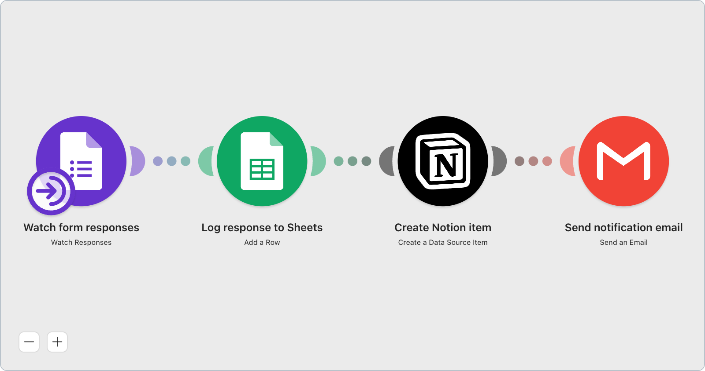

# Send Google Forms responses to Notion and email

Someone fills in your Google Form. The answer is saved to a spreadsheet, added to your Notion database, and emailed to you. No code.

## Before you start

You need three accounts: **Google** (the form and the spreadsheet), **Notion**, and a **Gmail** address to send from. Setup takes about 10 minutes and you never leave the Make screen after importing. Nothing here needs coding — you click, pick, and type.

## What it does

| Step | App | What happens |
|---|---|---|
| 1 | Google Forms | Checks your form for new answers (`watchResponses`) |
| 2 | Google Sheets | Adds a row: submitted at, respondent, response ID (`addRow`) |
| 3 | Notion | Creates one item in your database (`createDataSourceItem`) |
| 4 | Gmail | Emails you that a response arrived (`ActionSendEmail`) |

## Prepare your Notion database

Do this **before** you open step 3. Create a database in Notion with exactly these three properties, then click *…* → *Connections* on that database and add your Make integration, otherwise Make cannot see it. Get the names and types right and step 3 becomes three dropdown picks.

| Property name | Type | Maps from |
|---|---|---|
| `Name` | Title | `{{1.responseId}}` |
| `Submitted at` | Date | `{{1.createTime}}` |
| `Respondent` | Email | `{{1.respondentEmail}}` |

## Accounts to connect (4)

- [ ] Google Forms  - [ ] Google Sheets  - [ ] Notion  - [ ] Gmail

**Red modules after import = not yet connected, not broken.** Accounts, file choices and Notion property links belong to you, so they are never stored inside a shared blueprint. Open each red module and pick an account.

## Operations per run

**4 operations per form response** — one for each step. No AI modules, so this costs you no AI credits. Make checks the form on a schedule; if two responses arrive between checks, that cycle costs 8.

## Import → Reconnect → Run once

1. **Import** — in Make go to **Scenarios** → **Create a new scenario** → click the **⋯** button at the bottom of the screen → **Import Blueprint** → upload `blueprint.json`.
2. **Reconnect** — step 1: sign in to Google, then choose your form. Step 2: choose the spreadsheet and sheet, check the three columns line up. Step 3: sign in to Notion, use the **ID Finder** to pick the database you prepared above, then match each property to the column beside it. Step 4: type the address that should get the alert.
3. **Run once** — submit a test answer to your form, press **Run once**, and check that the row, the Notion item and the email all appeared.

## TODO

- `canvas.png` screenshot and `shareUrl` missing — `status` stays `draft`.
- Connection shape (omitted `__IMTCONN__` + declared `metadata.parameters`) follows `docs/blueprint-spec.md` §3; **pending R2 confirmation** that the importer renders these modules red rather than silently invalid.
- Notion step 3 ships `mapper.select: "list"` + `data_source: ""` (both verified static fields under `__IMTCONN__.options.nested.store`, `domain: expect`). The `"map"` / Generic Fields branch would allow pre-filling `fields[]` too, but its `data_source` has no ID Finder RPC and a Notion data source ID is not the ID in the database URL — rejected as a no-code dead end. Per-property values stay unmapped because `listDatabaseFields` is RPC-driven and account-specific. Nothing was guessed.
- Gmail uses app v2 `ActionSendEmail`; v4 `sendAnEmail` exists but exposes no static `expect`, so its mapper fields are not readable from the API.
- No error handler by design — `error-handling.md:16` says do not add one unless asked, and directive operation cost is unmeasured.
- `demandSource` needs the real r/Make permalink (A6).
