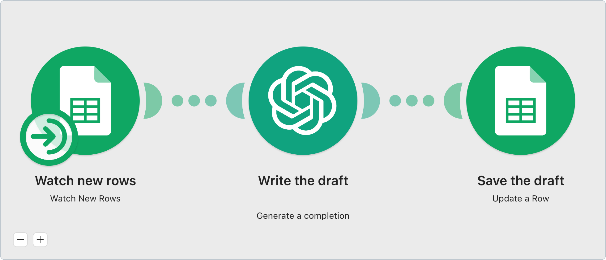

# Turn new Google Sheets rows into AI-written drafts with OpenAI

You type a product name and a few details into a spreadsheet row. OpenAI writes the product description, and it lands back in the same row a moment later. No code.

## Before you start

You need two accounts: **Google** (the spreadsheet) and **OpenAI** (an API key from platform.openai.com, with a little billing credit on it — the free ChatGPT login is not enough). Setup takes about 10 minutes and you never leave the Make screen after importing. Nothing here needs coding — you click, pick, and type.

## What it does

| Step | App | What happens |
|---|---|---|
| 1 | Google Sheets | Checks your sheet for rows you added since the last look (`watchRows`) |
| 2 | OpenAI | Writes the draft from the product name and details (`CreateCompletion`) |
| 3 | Google Sheets | Writes the draft back into that same row (`updateRow`) |

## Prepare your Google Sheet

Do this **before** you import. Create a spreadsheet with these four headings in row 1, in this order, then add your products from row 2 down. Step 3 writes into columns C and D by position, so the order matters more than the wording.

| Column | What goes in it | Filled by |
|---|---|---|
| A — `Product name` | The name of the product, e.g. *Cedar camping stool* | You |
| B — `Key details` | Anything the description should mention: material, size, price, who it is for | You |
| C — `Draft` | The description OpenAI wrote | The scenario |
| D — `Status` | Reads `Draft ready` once the row is done | The scenario |

Leave C and D empty. Fill A and B, and the row goes out on the next check.

## Accounts to connect (2)

- [ ] Google Sheets (steps 1 and 3)  - [ ] OpenAI (step 2)

**Red modules after import = not yet connected, not broken.** Accounts and file choices belong to you, so they are never stored inside a shared blueprint. Open each red module and pick an account.

## Operations per run

**3 operations per row** — one for each step. Step 1 ships with *Limit 1*, so one check costs 3 operations; set it to 5 and a check costs 15.

**0 Make AI credits.** Step 2 bills its tokens to your own OpenAI key, so it consumes none of the AI credits included in your Make plan. Your OpenAI bill for one draft is a few hundred tokens.

## Import → Reconnect → Run once

1. **Import** — in Make go to **Scenarios** → **Create a new scenario** → click the **⋯** button at the bottom of the screen → **Import Blueprint** → upload `blueprint.json`.
2. **Reconnect** — step 1: sign in to Google, then pick your spreadsheet and sheet from the dropdowns. Step 2: paste your OpenAI API key, then choose a model from the **Model** dropdown (a *mini* or *nano* model is the cheapest and plenty for this). Step 3: sign in to Google again (same account is fine) — everything else in step 3 is already filled in, because the spreadsheet, sheet and row number come straight from step 1.
3. **Run once** — type a product into row 2, press **Run once**, and check that the description lands in column C and `Draft ready` in column D.

If the prompt box in step 2 looks empty before you pick a model, pick the model first — the box appears once a model is chosen. The prompt that ships with this template is:

> You are a product copywriter. Write a product description of about 90 words for an online shop. Product name: *column A*. Key details: *column B*. Rules: plain sentences, no bullet points, no headings, no markdown, no emoji. Start with the benefit to the buyer. Use only the details above and invent nothing. Return the description text only.

## TODO

- `canvas.png` screenshot and `shareUrl` missing — `status` stays `draft`.
- `model` is deliberately unmapped. The chat model list is `rpc://openai-gpt-3@1/getModels?type=chat`, resolved against the importer's own OpenAI account, so any pre-filled id is a bet on their account; the field is a dropdown, which 2e0 rule 2 puts on the user's side of the line. `messages` and `response_format` hang off `rpc://openai-gpt-3@1/getModelSettings` and therefore render only after the model is picked — hence the fallback prompt printed above. Confirm on the first real import that the shipped `mapper.messages` survives the model pick; if it does not, pre-filling `model` becomes the lesser evil.
- `openai-gpt-3:askAnything` ("Simple text prompt") was the first choice: no connection at all, and it is the only module of the 47 in the app that carries a `centicreditsFormula`. Rejected because its sole static `expect` field is `model` — the prompt field comes from `rpc://openai-gpt-3@1/tierBanner`, and RPC is POST-only, so the field name could not be verified. Revisit if the API ever exposes it, or after one manual build in the designer.
- `aiCreditsPerRun: 0` is derived from the catalog (`centicreditsFormula` absent on `CreateCompletion`), not from a metered run. Verify on the first paid run.
- Step 3 addresses columns by position (`values["2"]`, `values["3"]`), because in `mode: "map"` the column list RPC has no resolvable spreadsheet to read headers from. Verified against Make's own public templates 12593 and 12120, both of which index the same way.
- No error handler by design — `error-handling.md:16` says do not add one unless asked, and directive operation cost is unmeasured.
- `demandSource` is the n8n corpus count; needs a real r/Make permalink (A6).
